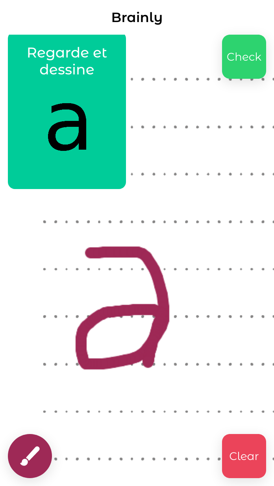

## Brainly 

Brainly is an application that allows children to write and speak correctly while having fun.




### Project Principles

An optical character recognition (OCR) tool based on [Tesseractjs](https://tesseract.projectnaptha.com/).
We use this technology to help children read and write correctly.


### Todo

- [x] A clean & beautiful interface
- [x] Canvas element
- [x] Change brush color
- [x] Export Canvas element as Image
- [x] Analyse canvas element with TesseractJS
- [ ] Add Text to Speech
- [ ] Creating gamification

### Setup

```bash
$ git clone https://github.com/agazinakou/Brainly.git
$ cd Brainly
$ npm install
```

### Usage

It simple just :

```bash
$ ionic serve
```

### Any question ?

If you need technical support or have any questions, please send a message to agazinakou@gmail.com or via skype: aziiin5.

Don't re-invent the wheel, Just re-align It.


